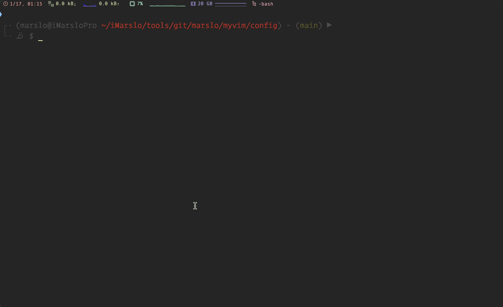
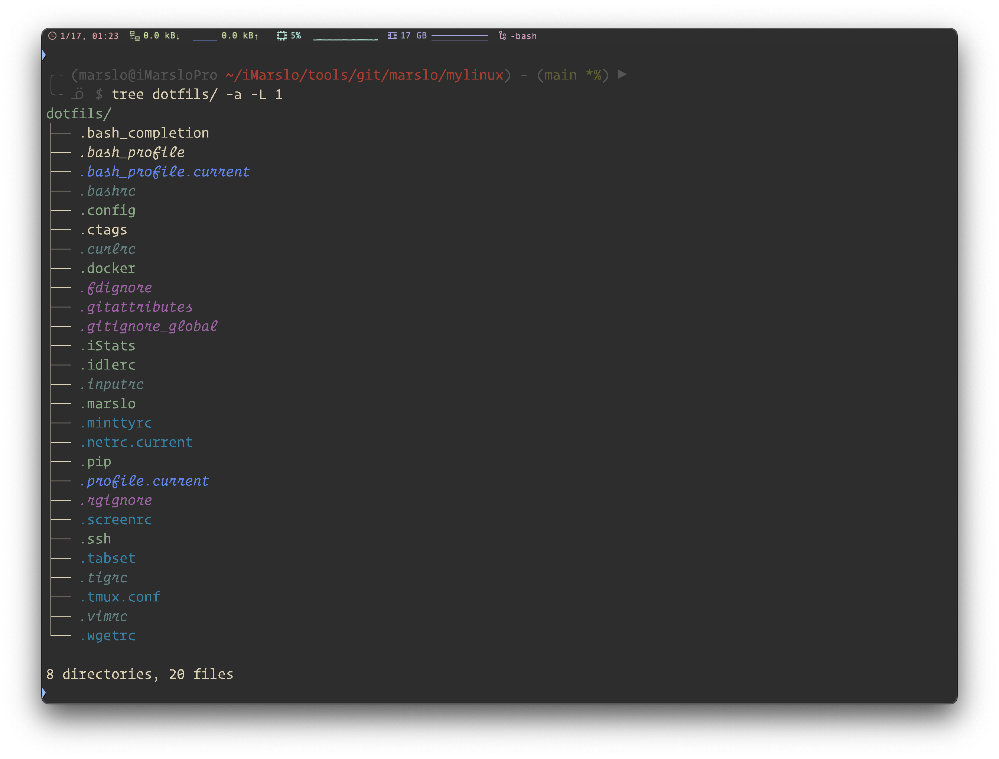
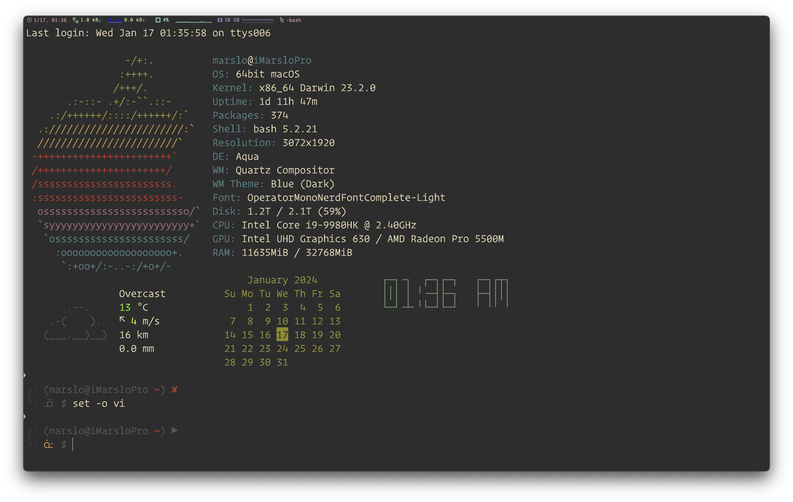
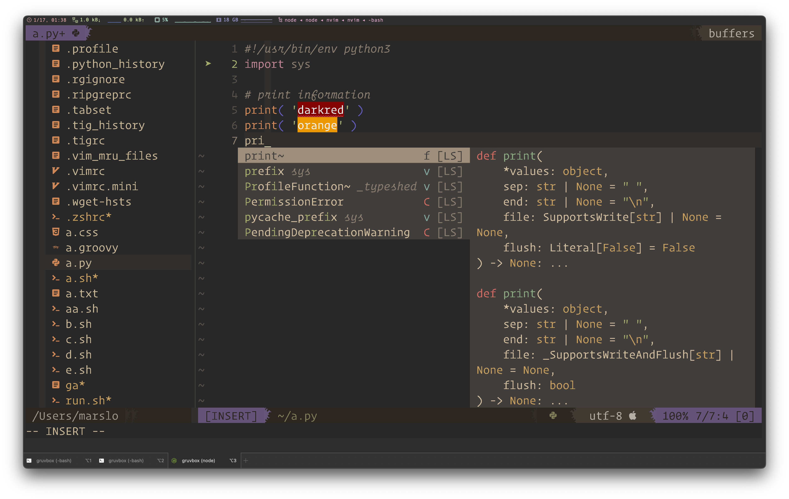
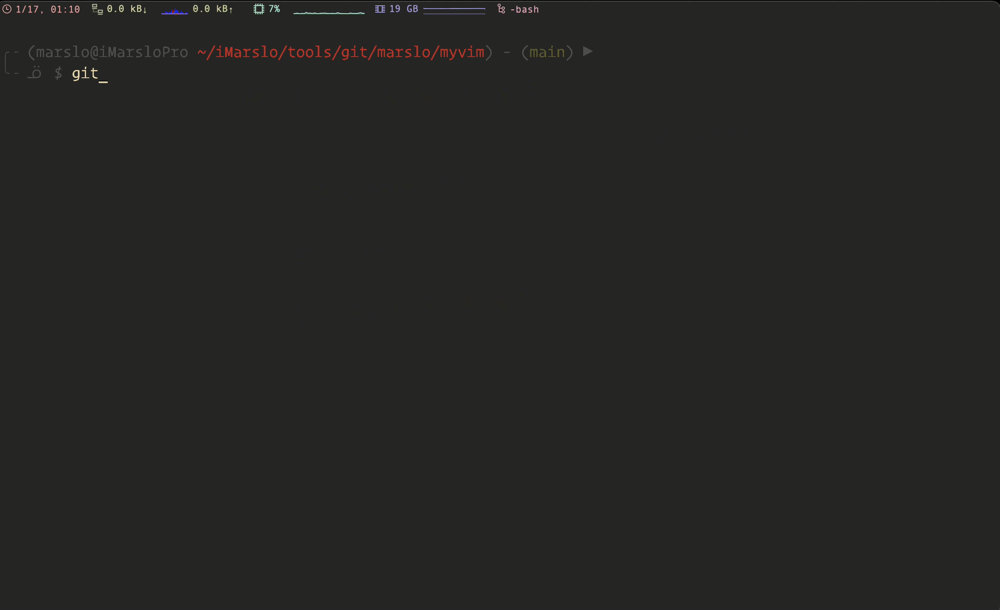
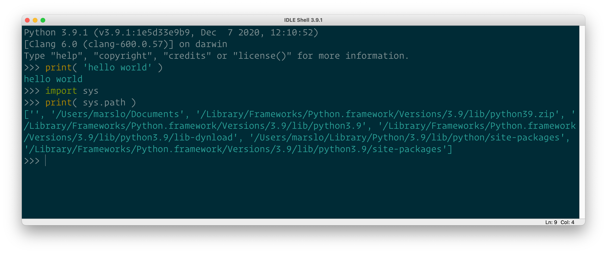
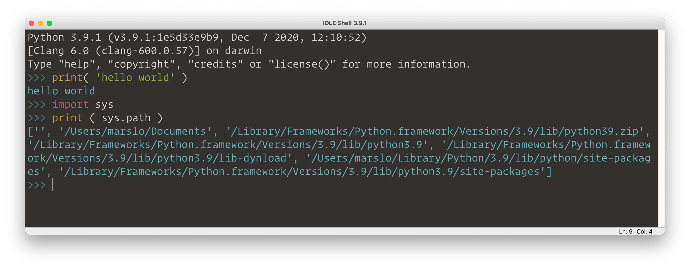

Life is short, make it easier!
==========

## version
- Author: marslo
- Email: marslo.jiao@gmail.com
- Created: 2013-10-07 21:43:42
- LastChange: 2024-01-17 01:19:06

## table of content
<!-- START doctoc generated TOC please keep comment here to allow auto update -->
<!-- DON'T EDIT THIS SECTION, INSTEAD RE-RUN doctoc TO UPDATE -->

- [setup](#setup)
- [folder structure](#folder-structure)
- [manual configure](#manual-configure)
  - [`~/.marslo/.marslorc`](#marslomarslorc)
  - [inputrc:](#inputrc)
  - [nvim](#nvim)
  - [gitalias](#gitalias)
  - [tig](#tig)
  - [python IDLE](#python-idle)

<!-- END doctoc generated TOC please keep comment here to allow auto update -->





## setup
```bash
$ bash install.sh
```

## folder structure
```bash
dotfils                    # -> $HOME
├── .config
│   ├── nvim               # nvim/init.lua
│   └── ...
├── .marslo
│   ├── .alias             # all alias
│   ├── bin                # all bins/scripts
│   └── vimrc.d            # all vimrc congiures
├── .vimrc                 # source vimrc.d/*
├── .marsorc               # ╮ source all in `.marslo/{.alias,bin}`
├── .marsorc.wsl           # ╯
├── .bashrc                # source ~/.marslorc or ~/.marslorc.wsl
└── ...                    # rc/profile/ignore/...
```



## manual configure
### `~/.marslo/.marslorc`
- add `source` as blow in `.bashrc` or `/etc/bashrc`(RHEL/CentOS) or `/etc/bash.bashrc`(Ubuntu) or `~/.bash_profile`(OSX)
  ```bash
  [ -f "~/.marslo/.marslorc" ] && source "~/.marslo/.marslorc"

  # wsl
  [ -f "~/.marslo/.marslorc.wsl" ] && source "~/.marslo/.marslorc.wsl"
  ```

### inputrc:
- Copy the `.inputrc` to `$HOME`
  ```bash
  $ cp ./dotfils/.inputrc ~/.inputrc
  ```


### nvim

  

  

### gitalias
```bash
$ cp ./dotfils/.marslo/.gitalias ~/.marslo

# included in .gitconfig
$ echo "[include]"                    >> ~/.gitconfig
$ echo "  path = ~/.marslo/.gitalias" >> ~/.gitconfig
# or
$ cat >> ~/.gitconfig << EOF
[include]
  path = ~/.marslo/.gitalias
EOF
```



### tig
#### installation
```bash
# ubuntu:
$ sudo apt install tig

# from source
$ git clone git@github.com:jonas/tig.git
$ make prefix=/usr/local/tig
$ sudo make prefix=/usr/local/tig install
```

- config: copy `.tigrc` to `$HOME` folder
  ```bash
  $ cp ./dotfils/.tigrc ~
  ```

### python IDLE




